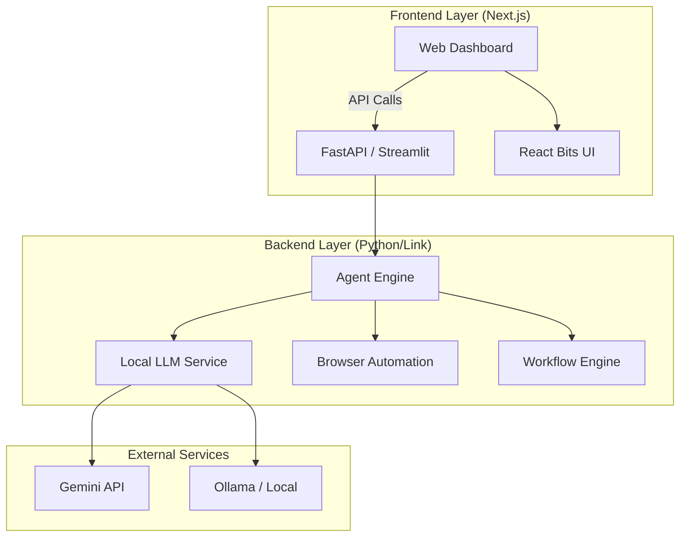

# PromptForge AI Studio ⚒️


**PromptForge** is an advanced AI Prompt Engineering Studio designed to bridge the gap between abstract agent design and concrete execution. It features a dual-architecture system: a Python-powered backend for heavy AI logic and agent orchestration, and a modern Next.js frontend for a premium user experience.

## 🚀 Key Features

*   **Multi-Agent Orchestration**: Build, test, and deploy complex agent swarms.
*   **Visual Workflow Builder**: Create n8n-style automation workflows powered by LLMs.
*   **Browser Automation**: Natural language to browser action execution.
*   **Prompt Optimization**: Auto-optimize prompts using genetic algorithms and RL.
*   **Dual Interface**:
    *   **Studio UI (Python)**: For deep engineering, debugging, and admin controls.
    *   **Web Dashboard (Next.js)**: For end-users and visual interactions.

## 🏗️ Architecture

PromptForge uses a hybrid architecture to leverage the best of both worlds: Python for AI/ML capabilities and TypeScript/React for responsive UI.



## 🛠️ Technology Stack

### Backend (Core Logic)
*   **Python 3.10+**: Primary language.
*   **Streamlit**: Admin/Engineering interface (`http://localhost:8501`).
*   **Google Gemini**: Primary LLM provider (via `gemini-2.0-flash-exp`).
*   **Pydantic**: Data validation and schema definition.

### Frontend (User Experience)
*   **Next.js 14**: React framework (`http://localhost:3000`).
*   **TypeScript**: Type-safe development.
*   **Tailwind CSS**: Styling system.
*   **React Bits**: Specialized UI components (Pixel Card, Spotlight, etc.).
*   **Framer Motion**: Advanced animations.

## 🏁 Getting Started

### Prerequisites
*   Python 3.10 or higher
*   Node.js 18 or higher
*   Git

### 1. Clone & Configure
```bash
git clone https://github.com/yourusername/promptforge.git
cd promptforge
```

### 2. Backend Setup (Python)
```bash
# Install dependencies
pip install -r yaprompt_python/requirements.txt

# Run the Engineering Studio
streamlit run yaprompt_python/studio.py
```
> Access the Studio at [http://localhost:8501](http://localhost:8501)

### 3. Frontend Setup (Next.js)
```bash
cd website

# Install Node modules
npm install

# Run the Development Server
npm run dev
```
> Access the Web Dashboard at [http://localhost:3000](http://localhost:3000)

## 🔧 Configuration

Create a `.env` file in the root directory:

```env
GEMINI_API_KEY=your_api_key_here
```

## 🤝 Contributing

Contributions are welcome! Please fork the repository and submit a Pull Request.

---
*Built with  by the PromptForge Team*
