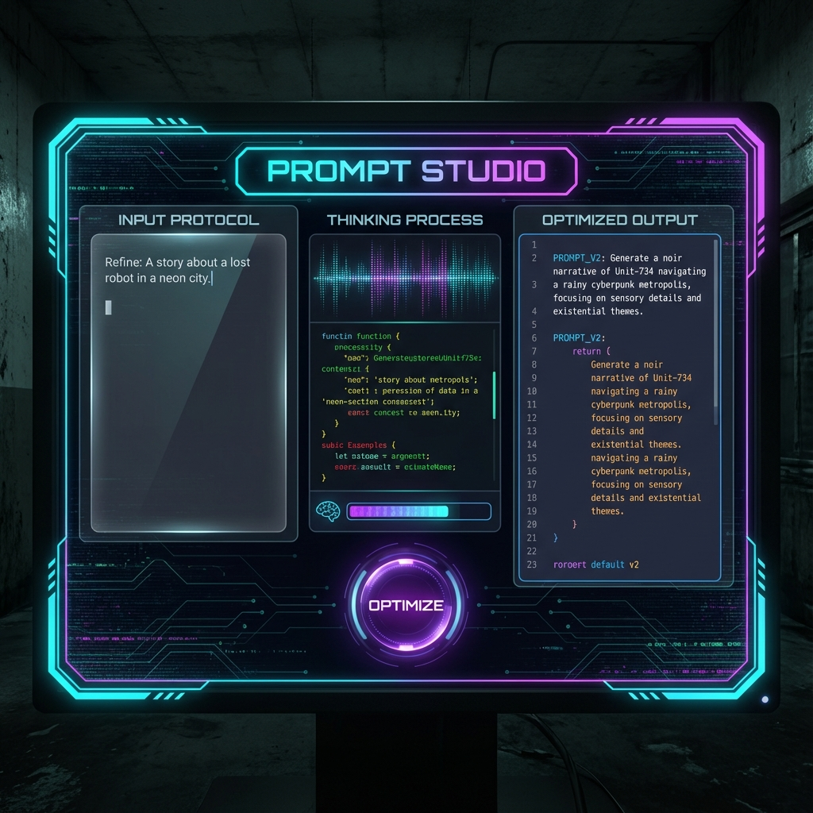
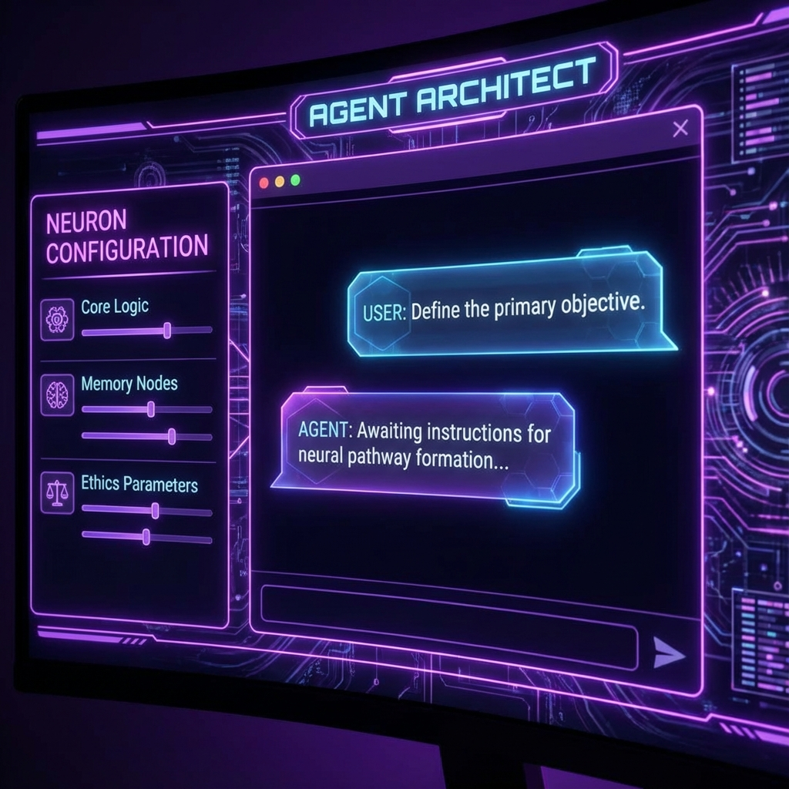
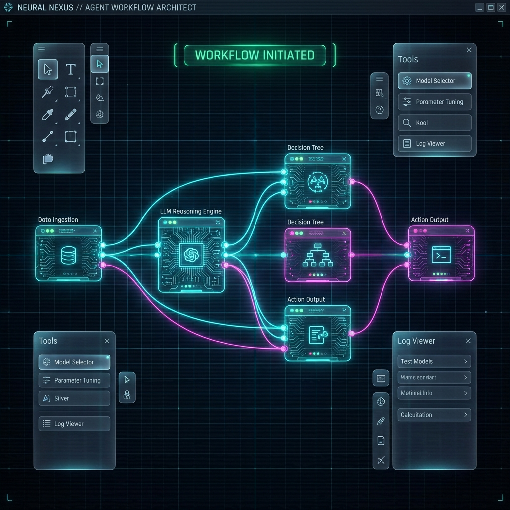
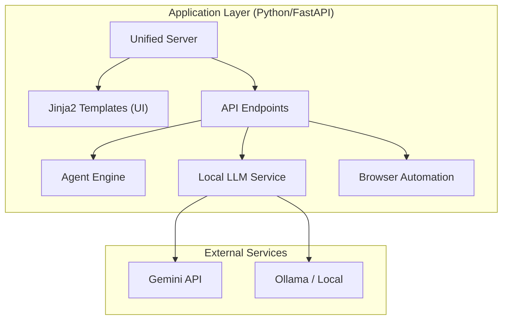

# PromptForge AI Studio ⚒️


**PromptForge** is an advanced AI Prompt Engineering Studio designed to bridge the gap between abstract agent design and concrete execution. It features a robust Python-powered backend using FastAPI and Jinja2 templates for a streamlined, unified experience.

## 🚀 Key Features

*   **Multi-Agent Orchestration**: Build, test, and deploy complex agent swarms.
*   **Visual Workflow Builder**: Create n8n-style automation workflows powered by LLMs.
*   **Browser Automation**: Natural language to browser action execution.
*   **Prompt Optimization**: Auto-optimize prompts using genetic algorithms and RL.
*   **Unified Interface**:
    *   **Studio UI**: For deep engineering and prompt refinement.
    *   **Agent Builder**: Conversational interface for creating agents.
    *   **Workflow Studio**: Visual tool for automation flows.

## 📸 Interface Gallery

> Experience a true "Dark Sci-Fi" coding environment designed for focus and flow.

| **Prompt Studio** | **Agent Architect** |
|:---:|:---:|
|  |  |

<div align="center">
  <p><strong>Neural Workflow Visualizer</strong></p>
  
</div>

## 🧬 Example Usage

**Scenario**: You want to optimize a vague prompt for a "Cyberpunk Novelist" agent.

1.  **Input Protocol**: Enter your raw prompt in the *Prompt Studio*.
    > "Write a story about a robot in a neon city."
2.  **Initialize**: Click the **[ OPTIMIZE ]** button.
3.  **Neural Processing**: The system uses recursive genetic algorithms to refine the prompt, adding constraints, tone, and sensory details.
4.  **Optimized Output**:
    ```text
    Act as a veteran cyberpunk novelist in the style of William Gibson.
    Write a 500-word noir narrative centered on 'Unit-734', a discarded service droid.
    Setting: The rain-slicked slums of Neo-Veridia, Level 4.
    Tone: Melancholic, gritty, high-tech low-life.
    Constraints: Include at least 3 sensory descriptions of neon light reflecting on wet metal.
    ```
5.  **Deploy**: One-click deploy this optimized persona to the **Agent Architect** to start chatting.

## 📸 Interface Gallery

> Experience a true "Dark Sci-Fi" coding environment designed for focus and flow.

| **Prompt Studio** | **Agent Architect** |
|:---:|:---:|
|  |  |

<div align="center">
  <p><strong>Neural Workflow Visualizer</strong></p>
  
</div>

## 🧬 Example Usage

**Scenario**: You want to optimize a vague prompt for a "Cyberpunk Novelist" agent.

1.  **Input Protocol**: Enter your raw prompt in the *Prompt Studio*.
    > "Write a story about a robot in a neon city."
2.  **Initialize**: Click the **[ OPTIMIZE ]** button.
3.  **Neural Processing**: The system uses recursive genetic algorithms to refine the prompt, adding constraints, tone, and sensory details.
4.  **Optimized Output**:
    ```text
    Act as a veteran cyberpunk novelist in the style of William Gibson.
    Write a 500-word noir narrative centered on 'Unit-734', a discarded service droid.
    Setting: The rain-slicked slums of Neo-Veridia, Level 4.
    Tone: Melancholic, gritty, high-tech low-life.
    Constraints: Include at least 3 sensory descriptions of neon light reflecting on wet metal.
    ```
5.  **Deploy**: One-click deploy this optimized persona to the **Agent Architect** to start chatting.

## 🏗️ Architecture

PromptForge uses a pure Python architecture for maximum power and flexibility:



## 🛠️ Technology Stack

*   **Python 3.10+**: Core logic and orchestration.
*   **FastAPI**: High-performance web framework.
*   **Jinja2**: Server-side template rendering for UI.
*   **Google Gemini**: Primary LLM provider (via `gemini-2.0-flash-exp`).
*   **Pydantic**: Data validation and schema definition.
*   **React (Optional)**: Converted frontend components available in `frontend/`.

## 🏁 Getting Started

### Prerequisites
*   Python 3.10 or higher
*   Git

### 1. Clone & Configure
```bash
git clone https://github.com/planksconstant-arch/PromptForge.git
cd PromptForge
```

### 1. Setup & Run
```bash
# Install dependencies
pip install -r yaprompt_python/requirements.txt

# Run the Application Server
python -m yaprompt_python.main
```

### 2. Access the Application
Once the server is running, access the tools at:
*   **📊 Dashboard**: [http://localhost:8000/](http://localhost:8000/)
*   **🪄 Prompt Studio**: [http://localhost:8000/studio](http://localhost:8000/studio)


## 🔧 Configuration

Create a `.env` file in the root directory:

```env
GEMINI_API_KEY=your_api_key_here
```

## 🤝 Contributing

Contributions are welcome! Please fork the repository and submit a Pull Request.

---
*Built with ❤️ by the PromptForge Team*
